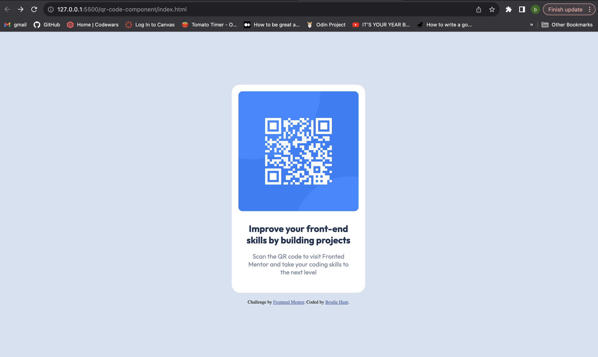

# Frontend Mentor - QR code component solution

This is a solution to the [QR code component challenge on Frontend Mentor](https://www.frontendmentor.io/challenges/qr-code-component-iux_sIO_H). Frontend Mentor challenges help you improve your coding skills by building realistic projects. 

## Table of contents

- [Overview](#overview)
  - [Screenshot](#screenshot)
  - [Links](#links)
- [My process](#my-process)
  - [Built with](#built-with)
- [Author](#author)

## Overview

This is a simple qr-code component built with HTML and CSS. 

### Screenshot

### Links

- Solution URL: [Github](https://github.com/brodiehunt/Frontend-mentor/tree/main/qr-code-component)
- Live Site URL: [Live](https://brodiehunt.github.io/Frontend-mentor/qr-code-component/index.html)

## My process

### Built with

- Semantic HTML5 markup
- CSS custom properties
- Flexbox
- Mobile-first workflow

## Author

- Frontend Mentor - [@brodiehunt](https://www.frontendmentor.io/profile/brodiehunt)
- Twitter - [@brodiehunt_](https://www.twitter.com/brodiehunt_)

